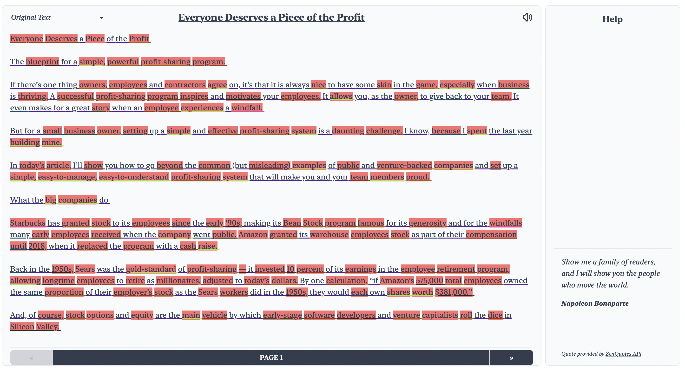
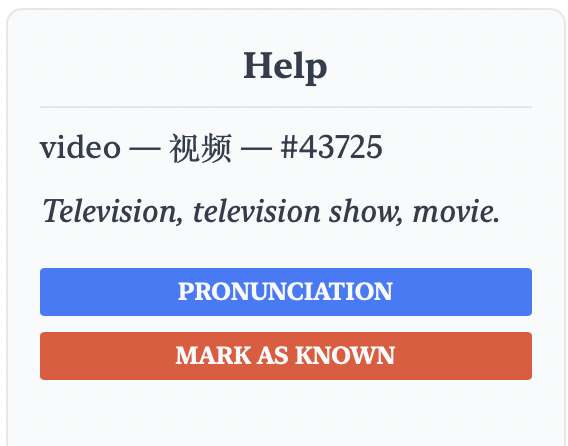

# LinguaKite

LinguaKite is a tool to learn English with, but it can be easily adapted to support other languages. Users have a database of articles accessible (as well as being able to upload their own), and they can read through each of these articles with a dictionary, translation, frequency information, and personalized highlighting based on their understanding of the word.

Additionally, users can improve their vocabulary and reading comprehension through quizzes, explore in-depth their wordbank, and view detailed statistics about their progress (done via Natural Language Processing). Images below demonstrate the tool in action:

Image            |  Image
:-------------------------:|:-------------------------:
  |  
  |  
  |  
  |  
  |  
  |  

## Features
- Sortable database of English articles with information about length, unique words, total words, sentence length, % words known, etc.
- Database can be added to with custom articles
- Questions can be asked about articles in the database
    - Multiple choice questions
    - 'Order-type' questions where you properly order sentences and words
    - Define vocab questions
    - *If you aren't on Apple Silicon as I am, you can even use the Questgen.ai library to generate advanced multiple choice, boolean, and FAQ-type questions*
- Time-based daily goals can be set
- Statistics and achievements for user progress can be viewed
- User has a 'bank' of known words, where each known word has a translation, # of times seen, definition, and frequency rank 
    - This bank can be added to with one click when reading an article
    - The bank can be filled in bulk with a file or estimated vocab size
- When reading articles, each word is underlined based on difficulty and highlighted based on whether or not the user knows it
    - Words can be clicked on for a definition, translation, and pronunciation
    - The entire article can be read aloud with TTS
    - A random motivational quote is present on the bottom right for encouragement
    - A summarized version of the text and synonymized version (replace hard words with easier synonyms) are available for reading as well
- Robust authentication is in place, and includes a secure way of logging in indefinitely ('remember me') using the token refresh pattern

## Installation

Linguakite is currently not hosted anywhere, as there would be a database fee. This means that if you'd like to give it a spin, you'll have to download it manually. However, the process is relatively straightforward.

1. Download [Postgres](https://postgresapp.com/) and follow installation instructions.
2. Create a new database called `linguakite` by typing `createdb linguakite` in your command line.
3. Clone this repository to a place you'll remember with the clone button at the top right.
4. Navigate to the repository directory in the command line.
5. Run `psql linguakite < server/data/db_dump.sql` in your command line to import all the data (a couple thousand articles with fields already pre-computed). 

    There may be warning messages after running the import, since my username was dumped with the database, and your Postgres likely doesn't have the same username configured. However, these are just warnings, and the import should work anyway.
6. Install [Node](https://nodejs.org/en/download/) and Python 3 (the latter of which should already be with most systems).
7. Install the client libraries: `cd client` and then `npm install` (this may take a while).
8. Install the server libraries: `cd ../server` and then `pip3 install -r requirements.txt`.
9. Create environment variable files:
    ```
    # server/.env

    export APP_SETTINGS="config.DevelopmentConfig"
    export DATABASE_URL="postgresql:///linguakite"
    export FLASK_APP=app
    export SECRET_KEY="<YOUR-SECRET-KEY>"
    export JWT_SECRET_KEY="<YOUR-SECRET-KEY-2>"
    ```

    ```
    # server/blueprints/.env

    # https://www.deepl.com/pro-api?cta=header-pro-api/
    export DEEPL_API_KEY="<YOUR-API-KEY>"
    ```
10. Start the server: `python3 main.py`.
11. In a new terminal window, start the client: `cd ../client && npm run dev`.

Enjoy!


## Sources

The data used is taken from Kaggle (Medium Articles) [here](https://www.kaggle.com/datasets/fabiochiusano/medium-articles), SimpleWiki dumps [here](https://dumps.wikimedia.org/simplewiki/), and the OANC (Open American National Corpus) [here](https://anc.org/data/oanc/download/).

Frequency list taken from [here](https://gist.github.com/h3xx/1976236).

All permissively licensed.

## Notes

- `server/data/medium-articles.csv` is not included, as it exceeds GitHub's maximum file size.
- If you'd like to add your own articles in bulk, I'd recommend caffeinating your Mac (`caffeinate`) as otherwise the request will likely time out — analyzing, stemming, and summarizing thousands of articles takes time.
- If you are unable to login/register after the server stopped, restart your browser and you will be able to login again.
- The site has been styled to work on a computer screen and UI will hence be best from a laptop/computer/monitor/large tablet.

To support remember-me, you'll have to modify the @nuxtjs/auth-next module. `runtime.mjs` and `runtime.js` should have the `setCookie()` call in the `setUniversal()` function of their `Storage` class rewritten as follows:

```js
this.setCookie(key, value, {
    maxAge: 60 * 60 * 24 * <day-length>,
    expires: new Date(Date.now() + 60 * 60 * 24 * <day-length>)
});
```

where `<day-length>` is how long you want the remember-me to work (e.g. by comparing with your server token expiration time).

## Contributing

You are free to download, modify, or fork the project for non-commercial purposes.

However, as this is a part of my International Baccalaureate CS Internal Assessment, I will not be accepting pull requests until July 2023.
